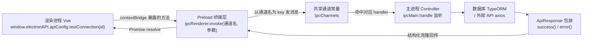
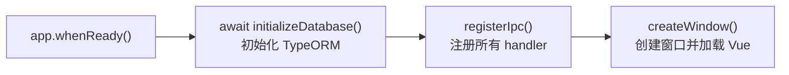
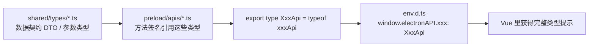

# 前后端交互流程

> 本文档说明项目当前的「前端 ↔ 后端」通信机制：一个 Vue 页面里的一次点击，是如何一路走到数据库或外部 API，再把结果带回页面的。
>
> 与本项目其它文档的关系：
>
> - 本文讲**现在的流程长什么样**（理解用）
> - `docs/ipc-workflow.md` 讲**怎么新增一个后端函数**（动手用）
> - `docs/ipc-event-push.md` 讲**主进程 → 渲染进程的反向推送链路**（日志、进度、通知等）
>
> 注意：本文只覆盖「渲染进程发起请求 → 主进程响应」这一个方向。反方向（主进程主动推送）用的是另一套 API，见 `docs/ipc-event-push.md`。

## 一、三个进程，三种角色

这是一个 Electron 应用，"前端后端"实际是被拆到两个相互隔离的进程里的：

| 角色 | 运行位置 | 代码目录 | 能做什么 |
| --- | --- | --- | --- |
| **渲染进程** | Chromium 浏览器环境 | `src/render/` | Vue 页面、组件、路由、状态管理。**拿不到 Node / Electron API** |
| **Preload 桥接层** | 窗口创建时注入 | `src/main/preload/` | 拥有 Node 能力，通过 `contextBridge` 把白名单 API 挂到 `window` 上 |
| **主进程** | Node.js 环境 | `src/main/main/`、`src/main/ipc/`、`src/main/database/` | 创建窗口、访问数据库（TypeORM）、调用外部 HTTP API（axios） |

关键在于 **进程隔离**：主窗口只配置了 `preload`，没有开启 `nodeIntegration`（见 `src/main/main/window.ts`）。因此渲染进程里 `require` / `ipcRenderer` 都不存在，**唯一合法的对外通道**就是 preload 通过 `contextBridge.exposeInMainWorld('electronAPI', api)` 暴露的那批方法（见 `src/main/preload/index.ts`）。

> 例外：`window.systemInfo` 也是 preload 暴露的，但它是**静态快照**（`src/main/preload/system.ts`），在 preload 里直接把 `process.platform` / 版本号读出来存成普通对象，**不经过 IPC**。

## 二、交互链路总览



链路上每个环节对应一个文件，各司其职：

| 环节 | 文件 | 职责 |
| --- | --- | --- |
| 通道名（契约） | `src/shared/constants/ipc_channels.ts` | 前后端共用的"电话号码"，规范 `api:<模块>:<动作>` |
| 主进程处理 | `src/main/ipc/apis/*.ts` | `ipcMain.handle` 监听通道 + 业务逻辑实现 |
| Preload 桥接 | `src/main/preload/apis/*.ts` | `ipcRenderer.invoke` 拨打通道，方法名与通道名一一对应 |
| 类型声明 | `env.d.ts` | 用 `typeof` 从 preload 推导 `window.electronAPI` 的完整签名，无需手写 |

## 三、一次完整调用经历了什么

以「Vue 里点一下『测试连接』按钮」为例：

1. **用户点击** —— `ApiConnectionView.vue` 中触发 `handleClickTestisApiConnected(row)`。
2. **前端调用** —— 执行 `window.electronAPI.apiConfig.testConnection(row.id)`。`window.electronAPI` 是 preload 暴露进来的对象。
3. **Preload 转发** —— 走到 `src/main/preload/apis/apiConfig.ts` 的 `testConnection`，它只是把调用翻译成 `ipcRenderer.invoke(IpcChannels.apiConfig.testConnection, id)`，即「往 `api:apiConfig:testConnection` 这条通道发个消息，带上 id」。
4. **主进程接单** —— 主进程启动时 `registerIpc()`（`src/main/ipc/index.ts`）已经 `new ApiConfigController().register()` 注册好 handler，于是 `ipcMain.handle` 命中，调用 `ApiConfigController.testConnection(id)`。
5. **业务逻辑** —— Controller 用 TypeORM 仓库查配置 + 关联密钥，再用 axios 请求外部 `/v1/chat/completions`。
6. **包装返回** —— 结果用 `success()` / `error()` 包成统一的 `ApiResponse` 结构返回。
7. **回传前端** —— IPC 把结果**结构化克隆**后传回渲染进程，`invoke` 返回的 Promise resolve。
8. **前端消费** —— 页面用 `res.success` 判断成败、`res.result` 取数据、`res.message` 弹提示。

启动顺序（决定了 handler 一定已就绪）见 `src/main/main/index.ts`：



先初始化数据库、再注册 IPC、最后才创建窗口加载页面——所以当 Vue 运行起来时，后端一定已经准备好接单了。

## 四、统一响应结构 ApiResponse

所有后端方法都**必须**返回 `ApiResponse<T>`（定义在 `src/shared/types/api-response.ts`），由 `success()` / `error()` 构造：

| 字段 | 类型 | 含义 |
| --- | --- | --- |
| `success` | `boolean` | 成败标志，**前端用它判断** |
| `code` | `ApiCode` | 业务状态码，`0` 成功、`-1` 失败 |
| `result` | `T` | 真正的数据载荷（泛型） |
| `message` | `string` | 供前端弹窗展示的提示文案 |

前端统一的消费姿势：

```ts
const res = await window.electronAPI.apiConfig.testConnection(row.id)
if (res.success) {
  message.success(res.message)
} else {
  message.error(res.message)
}
```

这样前端不需要 try/catch 去分辨各种异常——业务失败也会以 `success: false` 正常返回，而不是抛异常。

## 五、类型是怎样自动同步的

改 preload 的方法签名，前端类型会自动跟着变，**不需要手动维护**：



`env.d.ts` 用 `import type` + `typeof` 把 preload 导出的 `CatApi` / `ApiConfigApi` 等类型挂到 `Window` 接口上，因此是「改一处，全局同步」。

## 六、当前模块清单

所有业务模块都遵循同一套结构：**通道常量 → 主进程 Controller → preload API → Vue 页面**。

| 模块 | 通道前缀 | 主进程 Controller | Preload API | 主要能力 |
| --- | --- | --- | --- | --- |
| 小猫（示例/CRUD 模板） | `api:cat:*` | `src/main/ipc/apis/cat.ts` | `src/main/preload/apis/cat.ts` | 增删改查 |
| API 配置 | `api:apiConfig:*` | `src/main/ipc/apis/apiConfig.ts` | `src/main/preload/apis/apiConfig.ts` | 增删改查、拉取模型列表、测试连接 |
| API 密钥 | `api:apiKey:*` | `src/main/ipc/apis/apiKey.ts` | `src/main/preload/apis/apiKey.ts` | 增删改查 |
| 应用设置 | `api:appSetting:*` | `src/main/ipc/apis/appSetting.ts` | `src/main/preload/apis/appSetting.ts` | 单键读写 / 删除 |
| AI 对话 | `api:chat:*` | `src/main/ipc/apis/chat.ts` | `src/main/preload/apis/chat.ts` | 发送消息（自动读写聊天历史并调用 AI） |
| 会话 | `api:chatSession:*` | `src/main/ipc/apis/chatSession.ts` | `src/main/preload/apis/chatSession.ts` | 会话增删改查、列表（附最后一条消息摘要） |
| 聊天历史 | `api:chatHistory:*` | `src/main/ipc/apis/chatHistory.ts` | `src/main/preload/apis/chatHistory.ts` | 会话下的历史记录增删改查 / 清空 |

模块的挂载点有两处，新增模块时都要登记：

- 主进程侧：`src/main/ipc/index.ts` 里 `new XxxController().register()`
- Preload 侧：`src/main/preload/api.ts` 里把 `xxxApi` 加进 `api` 对象

## 七、数据流中的两条分支

Controller 里的业务逻辑最终会落到两种数据源之一：

- **本地数据库**：经 TypeORM 仓库读写 SQLite（如 `cat`、`apiConfig` 的增删改查），实体定义在 `src/main/database/entities/`。
- **外部 HTTP 接口**：用 axios 请求第三方 AI 服务（如 `apiConfig.findModels`、`apiConfig.testConnection`）。

不论走哪条，**返回值都必须先转成可序列化的纯数据**再交回 IPC。

## 八、两条硬约束

### 1. 只能传结构化可克隆的数据

IPC 用**结构化克隆算法**序列化数据，以下内容**不能**跨进程传递：

- 函数、Class 实例（如 axios 的 `AxiosResponse`）
- DOM 节点
- 原生模块对象（如 Node.js `Stream`）

所以调用外部 API 后，只传 `res.data`（纯 JSON）：

```ts
// ❌ 报错：An object could not be cloned
return success(res, '成功')

// ✅ 只传纯数据
return success(res.data, '成功')
```

### 2. 通道名是前后端唯一需要手动对齐的契约

通道名集中在 `src/shared/constants/ipc_channels.ts` 里定义，主进程 `ipcMain.handle` 与 preload `ipcRenderer.invoke` **共用同一份常量**，避免两边字符串写错对不上。

> 历史遗留：早期主进程下曾有一个 `src/main/ipc/channels.ts` 的重导出文件，现已删除，通道定义**只此一处**。
