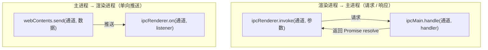

# 主进程 → 渲染进程的事件推送

> 本文说明「主进程主动向页面推送数据」这条**反向链路**：数据不是前端来要的，而是后端主动送过去的。
>
> 与本项目其它文档的关系：
>
> - `docs/ipc-architecture.md` 讲**渲染进程 → 主进程**的请求/响应链路（理解用）
> - `docs/ipc-workflow.md` 讲**怎么新增一个后端函数**（动手用）
> - 本文讲**主进程 → 渲染进程**的推送链路（理解 + 动手用），以「把主进程日志送进 DevTools 控制台」为实例

## 一、为什么需要反向链路

Electron 是多进程架构，**两个进程各有一套控制台**，互不可见：

| | 主进程 | 渲染进程 |
| --- | --- | --- |
| 运行环境 | Node.js | Chromium 页面 |
| `console.log` 输出到哪 | 启动它的**终端**（stdout） | **DevTools 控制台** |
| 能访问 DOM | ❌ | ✅ |

`src/main/ipc/apis/providerAdapter.ts` 里的 HTTP 请求发生在主进程，所以它的 `console.log` 只会出现在 `npm run dev` 的终端里，**DevTools 永远看不到**。

而 Electron **没有**提供 `mainProcess.logToDevTools()` 这类 API。所以只能反向思考：

> **把日志降级成普通数据，用 IPC 传到渲染进程，让渲染进程自己 `console.log`。**

整条链路本质是**一次单向 IPC 推送**，只不过推送的内容恰好是「日志」。同样的机制可以用来推送任何主进程主动产生的事件（下载进度、后台任务状态、窗口事件等）。

## 二、两种 IPC 模式

方向决定用哪套 API，这是本文最核心的一张图：



| | 请求 / 响应 | 单向推送 |
| --- | --- | --- |
| 发起方 | 渲染进程 | 主进程 |
| 渲染进程侧 API | `ipcRenderer.invoke` | `ipcRenderer.on` |
| 主进程侧 API | `ipcMain.handle` | `webContents.send` |
| 返回值 | Promise（有结果） | 无（fire-and-forget） |
| 能否多次 | 一次调用一次结果 | 注册一次，可收无数次 |
| 适用场景 | 查数据、增删改 | 日志、进度、通知 |

**为什么日志必须用推送？** 因为日志是主进程主动产生的，渲染进程事先不知道什么时候会有。用 `invoke` 的话，渲染进程就得不停轮询「有日志了吗」——既浪费又不可行。

## 三、四个角色

链路上一共涉及四个位置，各自职责清晰，**缺一不可**：

| 位置 | 文件 | 职责 | 角色 |
| --- | --- | --- | --- |
| 主进程 | `src/main/ipc/debugLog.ts` | 组装日志并 `send` 出去 | **发送方** |
| Preload | `src/main/preload/apis/debug.ts` | 用 `ipcRenderer.on` 登记监听器 | **订阅登记** |
| 页面 | `src/render/main.ts` | 提供回调、消费日志 | **订阅方** |
| Electron 内核 | —— | 序列化数据、查表、调用监听器 | **牵线人** |

两个关键认知：

1. **后端没有 `onLog`**——全项目只有一个 `onLog`，定义在 preload，被页面调用
2. **前后端互不相识**——后端只管往通道里丢数据，不知道谁在听；是 Electron 内核在中间牵线

> `on` 开头的命名永远出现在**接收方**。`ipcRenderer.on` 是渲染进程监听「主 → 渲染」的消息，`ipcMain.on` 是主进程监听「渲染 → 主」的消息，两者都在各自的接收侧。

## 四、完整流程

### 阶段一：应用启动（订阅，只发生一次）

**步骤 1｜Electron 创建窗口并加载 preload**

主进程创建 `BrowserWindow` 时加载 `src/main/preload/index.ts`。因为开启了 `contextIsolation`，页面**拿不到 `ipcRenderer`**，此时系统里有两个隔离的世界。

**步骤 2｜preload 往页面挂载 API**

```ts
contextBridge.exposeInMainWorld('electronAPI', api)
```

`contextBridge` 把 preload 的 `api` 对象映射成页面的 `window.electronAPI`。它能做到三件事：代理函数调用、结构化克隆数据、把页面传入的**回调**包成代理。

**步骤 3｜页面启动，注册订阅**

`src/render/main.ts`：

```ts
window.electronAPI?.debug.onLog(({ title, payload }) => debugLog(title, payload))
```

页面在做两件事：① 定义一个回调函数；② 把它作为参数传给 `onLog`。

> 这里的 `window.electronAPI.debug.onLog` **不是**渲染进程自己写的函数，它就是 preload 里那个 `debugApi.onLog`，被 contextBridge 映射到了 `window` 上。

**步骤 4｜onLog 内部包一层 listener**

`src/main/preload/apis/debug.ts`：

```ts
onLog: (callback) => {
  const listener = (_event, entry) => callback(entry)
  ipcRenderer.on(IpcChannels.debug.log, listener)
  return () => ipcRenderer.off(IpcChannels.debug.log, listener)
}
```

为什么要包一层？因为 `ipcRenderer.on` 调用监听器时是**两个**参数：

```ts
listener(IpcRendererEvent, ...args)
//       ↑ 事件对象（谁发的、时间等）
```

直接把 `callback` 交给 Electron 的话，它收到的第一个参数会是事件对象而不是日志内容，解构出来全是 `undefined`。所以必须夹一层把事件对象丢掉。

此刻内存里的状态：`listener` 通过闭包持有页面传来的 `callback`。**`callback` 到此就停下脚步了，不会再往任何地方去。**

**步骤 5｜注册到 IPC 表**

`ipcRenderer.on('api:debug:log', listener)` 会在渲染进程的 Electron 内核里登记：

| 通道名 | 监听器列表 |
| --- | --- |
| `api:debug:log` | `[listener]` |
| `api:chat:chat` | `[...]` |

阶段一到此结束，前端「准备好了」。

### 阶段二：主进程产生日志并推送

**步骤 6｜页面发起对话**

ChatTestView 里 `window.electronAPI.chat.chat(params)` → `ipcRenderer.invoke('api:chat:chat', params)`。

**步骤 7｜主进程接收**

`ipcMain.handle(IpcChannels.chat.chat, (_e, params) => this.chat(params))` 命中。

**步骤 8｜查数据库拿配置**

`ChatController.chat()` 用 TypeORM 查 `api_config` 并关联 `api_key`。

**步骤 9｜调用适配器**

```ts
const reply = await sendOpenAI(cfg, params.messages, { max_tokens: params.max_tokens })
```

**步骤 10｜组装请求三要素**

`src/main/ipc/apis/providerAdapter.ts`：

```ts
const url = `${trimSlash(cfg.base_url)}/v1/chat/completions`
const headers = { 'Content-Type': 'application/json', Authorization: `Bearer ${cfg.api_key.key}` }
const body = { model: cfg.model, max_tokens: options.max_tokens ?? DEFAULT_MAX_TOKENS, messages }
```

**注意：此时请求还没发出去**，只是把「要发什么」准备好了。先组装再发送，既方便调试打印，也让「到底发了什么」一目了然。

**步骤 11｜主动打日志**

```ts
logHttpRequest('chat.sendOpenAI', { url, headers, body })
```

**步骤 12｜掩码敏感头**

`logHttpRequest` 会先过一遍 `maskHeaders()`，把认证头掩码掉再打：

```ts
mainDebugLog(title, {
  url: request.url,
  headers: maskHeaders(request.headers),   // Authorization → "sk-1...cdef"
  body: request.body,
})
```

命中 `authorization` / `x-api-key` / `api-key` / `proxy-authorization` 的值会被裁成首尾各 4 位。这样既能核对是不是同一把 key，又不会把完整密钥留在日志里。

**步骤 13｜双投递**

```ts
export function mainDebugLog(title: string, payload: unknown): void {
  if (!env.isDev) return                                  // ① 仅开发模式
  console.log(`[${title}]`, payload)                      // ② 主进程终端
  const entry: DebugLogEntry = { title, payload }
  for (const win of BrowserWindow.getAllWindows()) {
    if (win.isDestroyed()) continue                       // ③ 跳过正在关闭的窗口
    win.webContents.send(IpcChannels.debug.log, entry)    // ④ 推向渲染进程
  }
}
```

`webContents` 是每个 BrowserWindow 内部的页面内核对象，`webContents.send()` 就是「主动往这个页面推数据」的动作。

### 阶段三：数据跨进程，回调被触发

**步骤 14｜内核序列化并投递**

Electron 把 `entry` 用**结构化克隆**算法序列化，通过进程间管道送到渲染进程。

**步骤 15｜内核查表找到 listener**

渲染进程的 IPC 内核拿通道名 `api:debug:log` 去查步骤 5 建立的表，找到 `[listener]`。

**查找和调用都是 IPC 内核做的，主进程并不知道 listener 的存在。**

**步骤 16｜调用 listener**

```ts
listener(eventObject, { title: 'chat.sendOpenAI', payload: {...} })
```

**步骤 17｜listener 转交**

`listener` 丢弃事件对象，只把 `entry` 交给闭包里的 `callback`。

**步骤 18｜callback 执行**

即页面在步骤 3 定义的那个函数，实际发生的是：

```ts
debugLog('chat.sendOpenAI', { url, headers, body })
```

**步骤 19｜真正打印**

`src/render/composables/useDebugLog.ts`：

```ts
console.group(`%c ${channel}`, isError ? ERROR_STYLE : SUCCESS_STYLE)
console.log(result)
console.groupEnd()
```

**只有到这里才第一次真正调用 `console.log`**，而且是在渲染进程里调用的，所以出现在 DevTools。

### 阶段四：回到正常业务流

**步骤 20｜axios 真正发请求**

`logHttpRequest` 之后，`sendOpenAI` 才用组装好的三要素发起真实请求。

**步骤 21｜解析并返回**

取 `res.data.choices[0]`，包成 `ApiResponse`，通过步骤 6 那个 Promise 回到页面。

### 全流程速查

| # | 阶段 | 位置 | 动作 |
| --- | --- | --- | --- |
| 1 | 启动 | 主进程 | 创建窗口，加载 preload |
| 2 | 启动 | Preload | `contextBridge` 挂载 `window.electronAPI` |
| 3 | 启动 | 页面 | 调 `onLog(myCallback)` |
| 4 | 启动 | Preload | 包 `listener`，闭包捕获 `myCallback` |
| 5 | 启动 | Preload | `ipcRenderer.on` 登记到 IPC 表 |
| 6 | 运行 | 页面 | `invoke('api:chat:chat')` |
| 7-9 | 运行 | 主进程 | handler → 查库 → 调 `sendOpenAI` |
| 10 | 运行 | 主进程 | 组装 url / headers / body |
| 11-12 | 运行 | 主进程 | `logHttpRequest` → 掩码敏感头 |
| 13 | 运行 | 主进程 | 终端打印 + `webContents.send` |
| 14 | 运行 | 内核 | 序列化、跨进程投递 |
| 15-16 | 运行 | 内核 | 查表，调用 listener |
| 17-18 | 运行 | Preload | `listener` → `myCallback` |
| 19 | 运行 | 页面 | **`console.log` → DevTools** |
| 20-21 | 运行 | 主进程 | axios 发请求、解析、返回 |

## 五、涉及的文件

| 文件 | 作用 |
| --- | --- |
| `src/shared/types/debug_log.ts` | `DebugLogEntry` 契约：`{ title, payload }` |
| `src/main/ipc/debugLog.ts` | `mainDebugLog()` / `logHttpRequest()` / 密钥掩码 |
| `src/shared/constants/ipc_channels.ts` | 新增 `debug.log` 通道名 |
| `src/main/preload/apis/debug.ts` | `debugApi.onLog()`，返回取消订阅函数 |
| `src/main/preload/api.ts` | 把 `debugApi` 挂进 `api` 对象 |
| `env.d.ts` | `DebugApi` 类型声明（`window.electronAPI.debug`） |
| `src/render/main.ts` | 应用启动时订阅，转发给 `debugLog` |
| `src/main/ipc/apis/providerAdapter.ts` | 先组装请求，再 `logHttpRequest`，最后发送 |

## 六、关键约束

| 约束 | 原因 |
| --- | --- |
| **函数无法跨进程** | IPC 用结构化克隆算法，只能传普通对象 / 数组 / 基本类型。函数、class 实例、DOM 节点、Vue 响应式 proxy 都会抛错。回调之所以能工作，是因为它**从未跨进程**——只是留在 preload 的闭包里被本地调用 |
| `listener` 必须存变量 | `ipcRenderer.off(channel, fn)` 靠**函数引用相等**匹配。写两个长得一样的箭头函数是两个不同对象，`off` 找不到，监听器移除失败，造成内存泄漏 |
| 遍历窗口要查 `isDestroyed()` | 窗口正在关闭时 `send()` 会抛异常 |
| 用 `env.isDev` 拦截 | 生产环境静默，避免主进程日志泄漏到用户控制台，也省掉无谓的 IPC 开销 |
| 页面订阅要用可选链 `?.` | 纯浏览器里没有 `window.electronAPI`，不加可选链会在模块加载阶段崩掉整个应用 |
| 组件内订阅要在 `onUnmounted` 取消 | 否则组件重复挂载会累积监听器，同一条日志被打印 N 次。`onLog` 已返回取消订阅函数 |
| 主进程 / preload 改动不热更新 | 需重启 Electron（kill 进程后 touch `src/main/main/index.ts`，或直接重启 `npm run dev`） |

## 七、如何再新增一条推送通道

与 `docs/ipc-workflow.md` 的「新增后端函数」对应，新增一条**推送**通道需要改 **6 处**：

| 序号 | 文件 | 做什么 |
| --- | --- | --- |
| 1 | `src/shared/types/xxx.ts` | 定义推送数据的类型契约 |
| 2 | `src/shared/constants/ipc_channels.ts` | 加通道名，如 `api:<模块>:<事件>` |
| 3 | `src/main/ipc/xxx.ts` | 实现发送函数，内部用 `webContents.send` |
| 4 | `src/main/preload/apis/xxx.ts` | 用 `ipcRenderer.on` 订阅，暴露 `onXxx(callback)` 并返回取消订阅函数 |
| 5 | `src/main/preload/api.ts` | 把新 api 对象挂进 `api` |
| 6 | `src/render/xxx.vue` 或 `main.ts` | 调用 `onXxx()` 消费数据 |

`env.d.ts` 依然**不需要手改**——它通过 `typeof` 从 preload 的 api 对象自动推导。

发送侧的最小实现：

```ts
export function pushXxx(data: XxxPayload): void {
  if (!env.isDev) return
  for (const win of BrowserWindow.getAllWindows()) {
    if (win.isDestroyed()) continue
    win.webContents.send(IpcChannels.xxx.event, data)
  }
}
```

订阅侧的最小实现：

```ts
onXxx: (callback: (data: XxxPayload) => void): (() => void) => {
  const listener = (_event: IpcRendererEvent, data: XxxPayload) => callback(data)
  ipcRenderer.on(IpcChannels.xxx.event, listener)
  return () => ipcRenderer.off(IpcChannels.xxx.event, listener)
}
```

> 代价提示：每次推送都会触发一次跨进程序列化。低频事件（日志、进度）完全无所谓；如果将来要在主循环里高频推送，需要先做节流或改为按需拉取。
